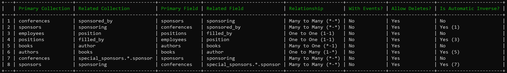

# Entry Relationships

> Entry Relationships provides a simple way to keep related Statamic entries in sync, automatically.

## Overview

Entry relationships can help to dramatically simplify keeping related Entries in sync with each other.

For example, if you had a `conferences` collection that had a `sponsored_by` (containing a list of sponsors) field that needed to be kept in sync with a `sponsors` collection that contained a `sponsoring` field (containing a list of conferences that sponsor is sponsoring), the Entry Relationships addon lets you express this relationship like so:

```php
<?php

namespace App\Providers;

use Illuminate\Support\ServiceProvider;
use Stillat\Relationships\Support\Facades\Relate;

class AppServiceProvider extends ServiceProvider
{
    public function boot()
    {
        Relate::manyToMany(
            'conferences.sponsored_by',
            'sponsors.sponsoring'
        );
    }
}
```

Once a relationship has been created, Entry Relationships will leverage Statamic's entry events to keep things in sync automatically.

Relationships are also bi-directional. Updating the conference entries will automatically add the conference to any related sponsors. Updated the sponsors instead? No problem! Any conferences those sponsors are related to will also be updated!

Entry Relationships will keep track of and automatically apply the following types of updates:

* New entry relationship: A new sponsor was added to a conference. The conference will also be added to the `sponsors` entry.
* A relationship being removed: A sponsor was removed from a conference. The conference will also be removed from the `sponsors` entry.
* Related entry being deleted: A `conferences` entry was deleted. Any `sponsors` that reference the deleted `conferences` will be updated, and have that conference removed.

## How to Install

You can search for this addon in the `Tools > Addons` section of the Statamic control panel and click **install**, or run the following command from your project root:

``` bash
composer require stillat/relationships
```

## How to Use

Made it past the introduction? Fantastic! Entry Relationships supports a number of relationship types, as well as provides a few helper commands.

### Types of Relationships

Entry Relationships supports the following types of relationships:

* **Many to Many**: There may be many conferences supported by any number of sponsors, and each sponsor can support any number of conferences.
* **Many to One**: Many books may be written by a single author.
* **One to Many**: An author may have written many books.
* **One to One**: A specific job position may only be filled by one employee, and a single employee can only hold a single position at a time.

### Supported Data Entities

Entry Relationships supports the following data entities:

* **Entries**: Collection entries.
* **Users**: Individual users.
* **Terms**: Taxonomy terms.

By default, Entry Relationships will assume that the relationship is between entries for backwards compatibility. To
create a relationship between users and your entries, you will need to prefix the relationship with the data type to
use when evaluating the relationship.

As an example, to create a relationship between a collection of conferences and the users who are managing those
conferences, we could use something similar to the following:

```php
<?php

namespace App\Providers;

use Illuminate\Support\ServiceProvider;
use Stillat\Relationships\Support\Facades\Relate;

class AppServiceProvider extends ServiceProvider
{
    public function boot()
    {
        Relate::manyToMany(
            'user:managing_conferences',
            'conferences.managed_by'
        );
    }
}
```

Note that we only have to specify the field name when referencing users.

To create a Taxonomy Terms relationship, we must specify the entity type as well as the taxonomy name:

```php
<?php

namespace App\Providers;

use Illuminate\Support\ServiceProvider;
use Stillat\Relationships\Support\Facades\Relate;

class AppServiceProvider extends ServiceProvider
{
    public function boot()
    {
        Relate::manyToMany(
            'term:topics.posts',
            'posts.topics'
        );
    }
}
````

### Creating a Many to Many Relationship

> Example: Conferences can have many sponsors. Each sponsor can support many conferences.

To create a many to many relationship, you will need two collections. Each collection should contain an [entries](https://statamic.dev/fieldtypes/entries) field, referencing the other collection. Both of these fields will need to allow multiple entries to be associated.

For example, assuming the following collection setup:

A `conferences` collection containing a `sponsored_by` field referencing the `sponsors` collection:

```yaml
sections:
  main:
    display: Main
    fields:
      -
        handle: title
        field:
          type: text
          required: true
          validate:
            - required
      -
        handle: sponsored_by
        field:
          mode: default
          create: true
          collections:
            - sponsors
          display: Sponsors
          type: entries
          icon: entries
          listable: hidden
          instructions_position: above
          read_only: false
title: Conferences
```

and a `sponsors` collection referencing the `conferences` collection:

```yaml
sections:
  main:
    display: Main
    fields:
      -
        handle: title
        field:
          type: text
          required: true
          validate:
            - required
      -
        handle: sponsoring
        field:
          mode: default
          create: true
          collections:
            - conferences
          display: Sponsoring
          type: entries
          icon: entries
          listable: hidden
          instructions_position: above
          read_only: false
title: Sponsors

```

The following relationship can be defined within your site's service provider (`app/Providers/AppServiceProvider.php`):

```php
<?php

namespace App\Providers;

use Illuminate\Support\ServiceProvider;
use Stillat\Relationships\Support\Facades\Relate;

class AppServiceProvider extends ServiceProvider
{
    public function boot()
    {
        Relate::manyToMany(
            'conferences.sponsored_by',
            'sponsors.sponsoring'
        );
    }
}
```

The `manyToMany` method will automatically define the inverse relationship for you. It is *not* necessary to define a many to many relationship from sponsors to conferences.

If you need to create multiple many-to-many relationships, you may choose to use set syntax, which providers a shortcut for defining multiple relationships. For example, to
relate many collections to a taxonomy, you could use the following:

```php
<?php

namespace App\Providers;

use Illuminate\Support\ServiceProvider;
use Stillat\Relationships\Support\Facades\Relate;

class AppServiceProvider extends ServiceProvider
{
    public function boot()
    {
        Relate::manyToMany(
            'term:categories.field_name',
            'entry:{collection1,collection2,collection3,collection4}.field_name'
        );
    }
}
```

The above example will create a many-to-many relationship between the `categories` taxonomy and the `field_name` field, and is equivalent to the following:

```php
<?php

namespace App\Providers;

use Illuminate\Support\ServiceProvider;
use Stillat\Relationships\Support\Facades\Relate;

class AppServiceProvider extends ServiceProvider
{
    public function boot()
    {
        Relate::manyToMany(
            'term:categories.field_name',
            'entry:collection1.field_name'
        );
        
        Relate::manyToMany(
            'term:categories.field_name',
            'entry:collection2.field_name'
        );

        Relate::manyToMany(
            'term:categories.field_name',
            'entry:collection3.field_name'
        );

        Relate::manyToMany(
            'term:categories.field_name',
            'entry:collection4.field_name'
        );
    }
}
```

### Creating a One to Many Relationship

> Example: Many books can be written by one author. Each author can write many books.

To create a many to one relationship, you will need two collections. Each collection should contain an [entries](https://statamic.dev/fieldtypes/entries) field, referencing the other collection.

For this relationship, the collection that can be associated to a single other entry (`books` in this example) should have their entries field set to `max_items: 1`. The collection that can have many items associated with it (`authors` in this example) should have their entries field set to allow multiple associated entries.

Using a `books` collection referencing a single author:

```yaml
sections:
  main:
    display: Main
    fields:
      -
        handle: title
        field:
          type: text
          required: true
          validate:
            - required
      -
        handle: content
        field:
          type: markdown
          localizable: true
      -
        handle: author
        field:
          max_items: 1
          mode: default
          create: true
          collections:
            - authors
          display: Author
          type: entries
          icon: entries
          listable: hidden
          instructions_position: above
          read_only: false
title: Books

```

and an `authors` collection referencing many books:

```yaml
sections:
  main:
    display: Main
    fields:
      -
        handle: title
        field:
          type: text
          required: true
          validate:
            - required
      -
        handle: content
        field:
          type: markdown
          localizable: true
      -
        handle: books
        field:
          mode: default
          create: true
          collections:
            - books
          display: Books
          type: entries
          icon: entries
          listable: hidden
          instructions_position: above
          read_only: false
title: Authors

```

The following relationship can be defined within your site's service provider (`app/Providers/AppServiceProvider.php`):

```php
<?php

namespace App\Providers;

use Illuminate\Support\ServiceProvider;
use Stillat\Relationships\Support\Facades\Relate;

class AppServiceProvider extends ServiceProvider
{
    public function boot()
    {
        Relate::oneToMany(
            'books.author',
            'authors.books'
        );
    }
}
```

The `oneToMany` method will automatically create the inverse `manyToOne` relationship for you. You do *not* need to create a relationship from `authors.books` to `books.author`.

## Creating a Many to One Relationship

> Example: An author can write many books. Each book is written by a single author.

This relationship is the inverse of the one to many relationship.

Using the same setup from the `Creating a One to Many Relationship` section, a many to one relationship can be defined like so:

```php
<?php

namespace App\Providers;

use Illuminate\Support\ServiceProvider;
use Stillat\Relationships\Support\Facades\Relate;

class AppServiceProvider extends ServiceProvider
{
    public function boot()
    {
        Relate::manyToOne(
            'authors.books',
            'books.author'
        );
    }
}
```

When using the `manyToOne` method, you do not need to define the `oneToMany` inverse relationship from `books.author` to `authors.books`. This is done automatically for you.

### Creating a One to One Relationship

> Example: A job position may be held by a single employee. A single employee may only have one job at a time.

To create a many to one relationship, you will need two collections. Each collection should contain an [entries](https://statamic.dev/fieldtypes/entries) field, referencing the other collection. Each field must contain the `max_items: 1` configuration property.

Assuming an `employees` collection:

```yaml
sections:
  main:
    display: Main
    fields:
      -
        handle: title
        field:
          type: text
          required: true
          validate:
            - required
      -
        handle: position
        field:
          max_items: 1
          mode: default
          create: true
          collections:
            - positions
          display: Position
          type: entries
          icon: entries
          listable: hidden
          instructions_position: above
          read_only: false
title: Employees

```

and a `positions` collection:

```yaml
sections:
  main:
    display: Main
    fields:
      -
        handle: title
        field:
          type: text
          required: true
          validate:
            - required
      -
        handle: filled_by
        field:
          max_items: 1
          mode: default
          create: true
          collections:
            - employees
          display: 'Filled By'
          type: entries
          icon: entries
          listable: hidden
          instructions_position: above
          read_only: false
title: Positions

```


The following relationship can be defined within your site's service provider (`app/Providers/AppServiceProvider.php`):

```php
<?php

namespace App\Providers;

use Illuminate\Support\ServiceProvider;
use Stillat\Relationships\Support\Facades\Relate;

class AppServiceProvider extends ServiceProvider
{
    public function boot()
    {
        Relate::oneToOne(
            'employees.position',
            'positions.filled_by'
        );
    }
}
```

You do *not* need to define the inverse relationship from `positions.filled_by` to `employees.position`. This is done automatically for you.

## Other Things

Each relationship has a few properties that you can use to control how Entry Relationships handles them. These are:

* **withEvents**: This is `false` by default. When `true`, each updated entry will also emit their own `EntrySaving` and `EntrySaved` events
* **allowDelete**: This is `true` by default. When `true` deleting an entry will remove that entry from any associated entries

These properties can be adjusted by calling their corresponding methods after defining the relationship:

```php
<?php

namespace App\Providers;

use Illuminate\Support\ServiceProvider;
use Stillat\Relationships\Support\Facades\Relate;

class AppServiceProvider extends ServiceProvider
{
    public function boot()
    {
        Relate::manyToMany(
            'conferences.sponsored_by', 
            'sponsors.sponsoring'
        )->allowDelete(false)->withEvents(true);
    }
}
```

Additionally, you can define your own relationships manually (but it is much easier to use one of the previously covered methods):

```php
<?php

namespace App\Providers;

use Illuminate\Support\ServiceProvider;
use Stillat\Relationships\Support\Facades\Relate;

class AppServiceProvider extends ServiceProvider
{
    public function boot()
    {
        Relate::collection('conferences')
                ->field('sponsored_by')
            ->isRelatedTo('sponsors')
            -   >through('sponsoring')
            ->manyToMany();
    }
}
```

The automatic inverse relationships are *not* created when defining relationships manually.

## Console Commands

The Entry Relationships addon provides a few console commands that can help simplify implementation and debugging.

The addon provides the following commands:

* `php please relate:list`: Lists all defined relationships and their details
* `php please relate:fill`: Forces the addon to check all entries are in sync with each other. If not, they will be updated.

### The `relate:list` Command

Running `php please relate:list` will display a table of all defined relationships:



The first column displays an index number for each relationship. It has no meaning other than to help relate automatically created inverse relationships.

* **Primary Collection**: The collection that appears first in the relationship (the first collection handle provided, or the *left* collection)
* **Related Collection**: The collection that appears last when defining the relationship (the second collection handle provided, or the *right* collection)
* **Primary Field**: The field handle being used for the relationship, defined in the *primary* collection
* **Related Field**: The field handle being used for the relationship, defined in the *related* collection
* **Relationship**: A human friendly description of the relationship's type
* **With Events**: Indicates if entries will saved quietly, or not
* **Allow Deletes**: Indicates if related entries will be updated when their related entries are deleted
* **Is Automatic Inverse**: Indicates if the relationship was automatically created for you. If so, the relationship's index you defined will appear after it in parenthesis.

You can limit the results returned to a single collection like so:

```bash
php please relate:list collection
```

### The `relate:fill` Command

This command can be used to force the Entry Relationships addon to check and update all related entries.

A common use case for this is when you already had a `books` collection and have associated their `author`. Later on, you add a `books` field to the `authors` collection. Running this command will bring the `books` and `authors` entries in sync for you.

The `relate:fill` command supports a few options:

| Option | Description |
|---|---|
| `--dry` | Useful to see what entries would be updated, without actually updating them. |
| `-v` | Adds the count of added, removed, and unchanged items to the output. |
| `-vv` | Outputs the entry IDs when it performs an update. |
| `-vvv` | Outputs everything. |

You can limit the operation to a single collection like so:

```bash
php please relate:fill collection
```

## License

Entry Relationships is free software released under the MIT License.
